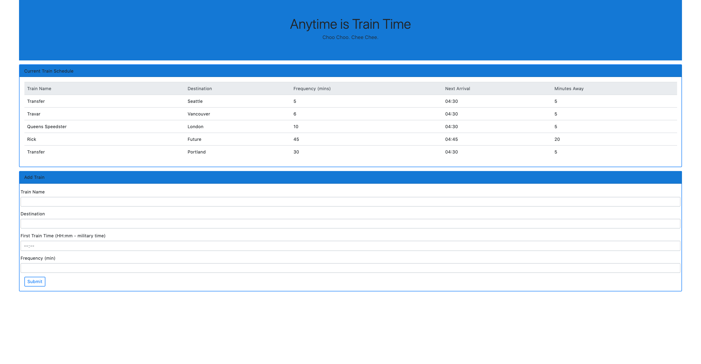

# Train Scheduler

The train scheduler is a web application that incorporates Firebase to host arrival and departure data, and this information will be retrieved and manipulated using Moment.js. The website will provide up-to-date information about various trains, namely their arrival and how many minutes remain until they arrive at their station.

## How to install and run

In order to use the program, you will need to follow this steps: 

            1. git clone https://github.com/alfa9317/Train_Activity
            2. cd into the Train_Activity and open the project 
            3. open index.html file in the browser

## --------------------👉🏻

## I just want to use it!

You can also just go to this url and start using it:
       https://alfa9317.github.io/Train_Activity/index.html

Required technologies:
Bootstrap,
Firebase,
Moment.js,
Visual Studio Code.
